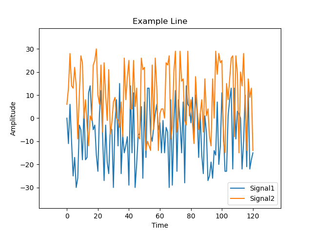
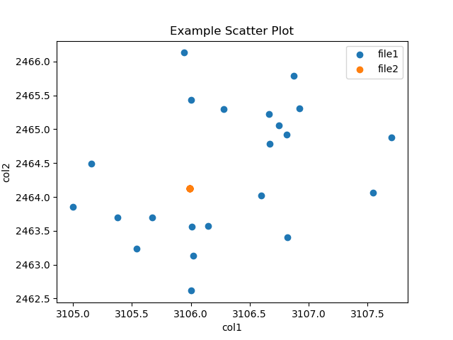
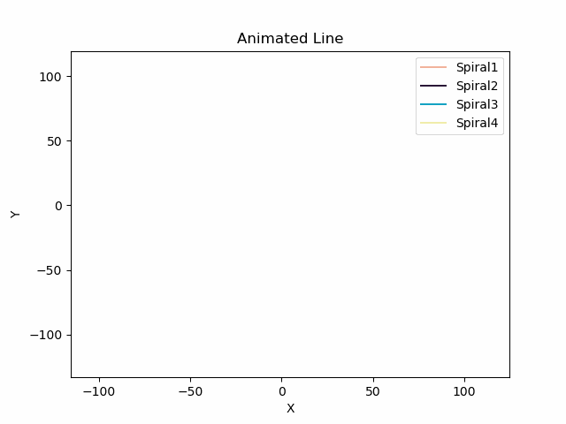
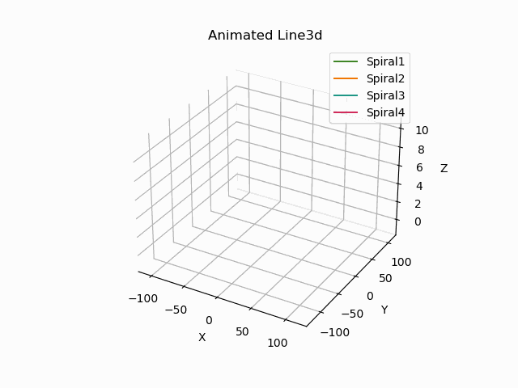
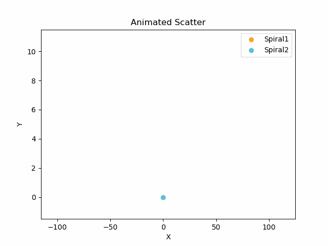
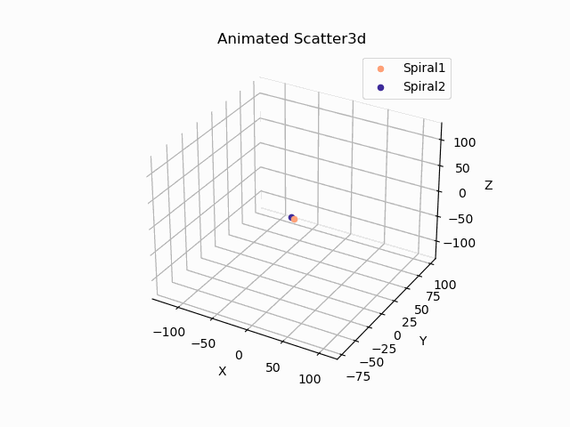

# Simple CSV Grapher 
**When running the following script, make sure that your ```log/``` folder is at the same directory level as this script.**



## Table of Contents
- [Requirements](#requirements)
- [Usage](#usage)
  - [Command line](#command-line)
  - [YAML Config File](#yaml-config-file)
- [Animated Graphs](#animated-graphs)
  - [Supported Graphs Types](#supported-graph-types)
- [Live View](#live-view)
  - [Supported Graph Types](#supported-graph-types-1)
- [Known Issues](#known-issues)

## Requirements:
 - Python 3.8 or newer
 - Python Packages
    - Matplotlib
    - PyYaml
    - Numpy

Downloading python packages using pip:
```bash
$ pip install matplotlib pyyaml numpy
```
## Usage
This script can be run in two distinct manners (command line and configuration file). To graph data from a single CSV command line may be the quickest option, though the other option still works. For graph data from multiple CSV files the yaml configuration is only option. 
### Command line
This method allows the user to plot and save a PNG file based on a specified CSV file. It only supports one file at a time. 
```
usage: CSV Graphing [-h] [-p PATH] [-f FILE] [-c COLUMN_HEADERS [COLUMN_HEADERS ...]] [-g GRAPH_TYPE] [-t TITLE] [-l] [-a] [-s] [-y YAML]

A simple program that graphs data from csv files.

options:
  -h, --help            show this help message and exit
  -p PATH, --path PATH  Path to desired file (leave blank if parent directory is log/).
  -f FILE, --file FILE  Desired CSV file.
  -c COLUMN_HEADERS [COLUMN_HEADERS ...], --column-headers COLUMN_HEADERS [COLUMN_HEADERS ...]
                        Give desired column headers (leave spaces between each header).
  -g GRAPH_TYPE, --graph-type GRAPH_TYPE
                        Choose one of the following ["line", "line_yy", "line3d", "scatter", "scatter3d", "scatterh", "hist", "stem"]. Default: 'line'.
  -t TITLE, --title TITLE
                        Provide title for the generated graph.
  -l, --live-view       Stream data from CSV files to Graph in real-time.
  -a, --animated        Creates an animated graph when true (will be saved as a gif).
  -s, --save            Save graph.
  -y YAML, --yaml YAML  Generate graph via yaml config file.
```
Go to ``` python3 CsvGrapher.py -h``` for an up-to-date description on how to use the command line. 

Here's an example of how to use the command line.
```bash
$ python3 CsvGrapher.py -p "path/to/file" -f filename.csv -c header_1 header_2 -g "line" -t "Example Line Graph" -s
```
### YAML Config File
Graphing multiple CSV files requires the use of the yaml configuration method. To use this method, run ```-y``` with the name of the yaml file (makes sure the yaml file is at the same level as this script). The following fields are used when writing a yaml file.
- **```files```** is the keyword used to find all the files that will be used to generate a graph. 
- **```path```** is the path to find the CSV file from within the ```log/``` directory. If the file is directly in the ```log/``` directory, put empty single quotes ```''``` in this field.
- **```name```** is the CSV filename. Using the keyword ```latest``` will grab the last generated file alphabetically. Using the keyword ```lastModified``` will grab the last modified file. 
- **```headers```** correlates to the column names that will be searched when retrieving data. Should be provided as a list of strings. 
- **```y_axis```** (Optional) A numerical number which indicates which y-axis the data should be plotted on. Required for running a graph type with two y-axes such as line_yy.
- **```labels```** correlates to the x, y, and z labels. The following options are valid:
    - x_label
    - y_label
    - y2_label (optional for two y axes)
    - z_label (optional for 3D plots)
- **```title```** is the title of the generated graph. 
- **```type```** determines what type of graph will be generated. Currently supports: a line graph (2D, 2D with two y-axes, and 3D), a scatter plot (2D and 3D), a scatter plot with histograms, histogram and stem plot. If nothing is chosen the default is 'line'.
- **```animated```** is a boolean value that determines whether the graph is animated and saved (when true).
- **```live```** is a boolean value that determines whether the graph is we generated using a continuous data stream for CSV files. The graph will be updated in real-time as new data is retrieved.
- **```save```** is a boolean value that determines whether the graph is saved (when true) or just plotted (when false). The format of saved file for graphs is as follows ```YYYY_MM_DD_hh_mm_ss_Title.png```.

Here's an example of how a YAML file can be made.
```yaml
files:
  - file1:
      path: path/to/file1
      name: file1.csv
      headers: [col1, col2]
  - file2:
      path: path/to/file2
      name: file2.csv
      headers: [col1, col2]
labels:
  x_label: col1
  y_label: col2
  z_label: col3
title: Example Scatter Plot
type: scatter
animated: false
live: false
save: true
```

Here's an example of how to run the script with the yaml config file. The ```.yaml``` extension does not need to included for the command to work.
```bash
$ python3 CsvGrapher.py -y example.yaml
```  

Example output:



## Animated Graphs
Both graphing methods: command line and YAML configuration file can take advantage of animated graphs as long as the graph specified is supported. If animation is enabled the save flag is disabled as all animated graphs are automatically saved as a GIF in ```log/animated/```. 

### Supported Graph Types
*2D Line Graph*



*3D Line Graph*



*2D Scatter Plot*



*3D Scatter Plot*



## Live View
Both graphing methods: command line and YAML configuration file can take advantage of live data streaming. However the YAML config is the only option that supports multiple data streams from CSV files. 

### Supported Graph Types
- *2D Line Graph* (looks similiar to animated line graph above)
- *2D Scatter Plot* (looks similar to animated scatter plot above)

## Known Issues
- Live View may not close after the window has been exited.